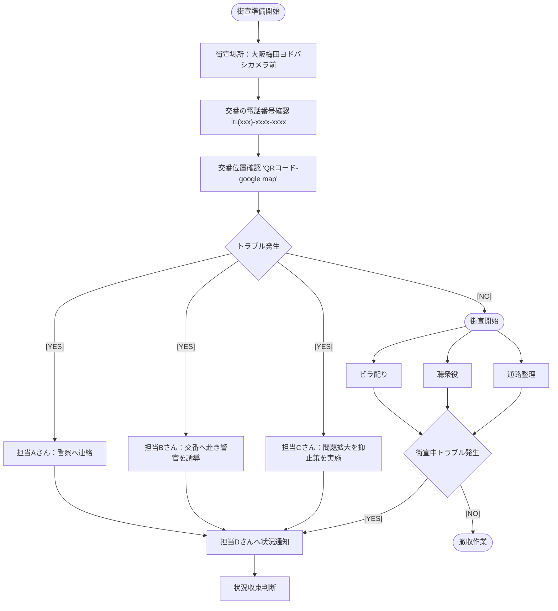

# ボランティア 作業フローチャート

```mermaid
flowchart TD
        ready(["街宣準備開始"])
        place["街宣場所：大阪梅田ヨドバシカメラ前"]
        task1["交番の電話番号確認 ℡(xxx)-xxxx-xxxx"]
        task2["交番位置確認 'QRコード-google map'"]
        
        method1["担当Aさん：警察へ連絡"]
        method2["担当Bさん：交番へ赴き警官を誘導"]
        method3["担当Cさん：問題拡大を抑止策を実施"]

        method0["担当Dさんへ状況通知"]
        method01["状況収束判断"]

        Trouble{"トラブル発生"}
        start(["街宣開始"])

        task01["ビラ配り"]
        task02["聴衆役"]
        task03["通路整理"]
        Trouble2{"街宣中トラブル発生"}

        task13(["撤収作業"])


        ready --> place
        place --> task1
        task1 --> task2


        task2 --> Trouble

        Trouble --[YES]--> method1
        Trouble --[YES]--> method2
        Trouble --[YES]--> method3

        method1 --> method0
        method2 --> method0
        method3 --> method0
        method0 --> method01


        Trouble --[NO]--> start

        start --> task01
        start --> task02
        start --> task03

        task01 --> Trouble2
        task02 --> Trouble2
        task03 --> Trouble2

        Trouble2 --[NO]--> task13
        Trouble2 --[YES]--> method0


```